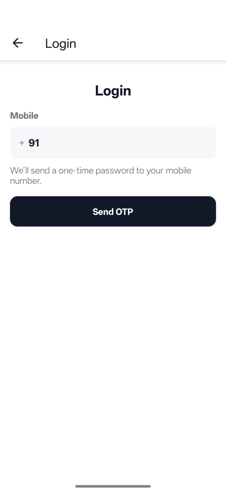
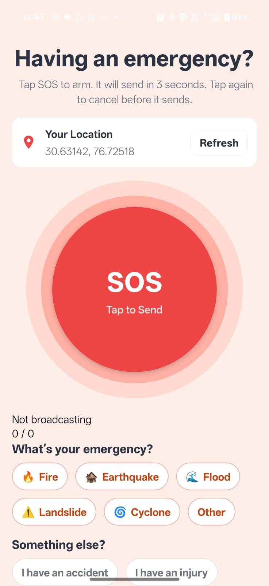
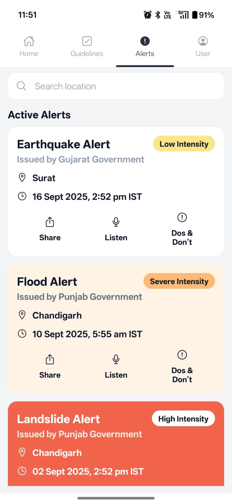
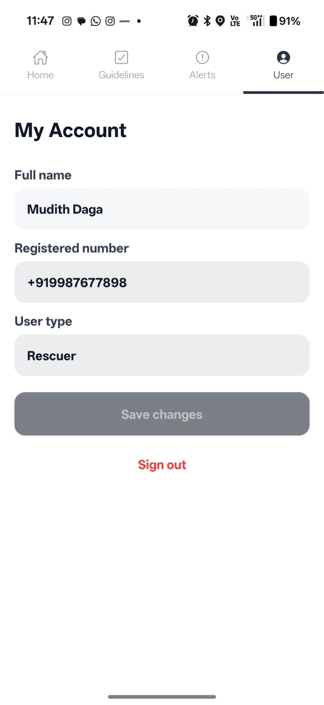

# ResQNet

Connecting lives when network fails. A disaster management and rescuing app using Mesh Networking.

<details>
<summary>Table of Contents</summary>

1. [About The Project](#about-the-project)
    - [What We Made](#what-we-made)
    - [Made With](#made-with)
    - [Project Structure](#project-structure)
2. [Features](#features)
    - [Offline SOS System](#offline-sos-system)
    - [Two-Way Communication](#two-way-communication)
    - [Alerts](#alerts)
3. [Getting Started](#getting-started)
    - [Requirements](#requirements)
    - [Installation](#installation)
4. [Usage](#usage)
    - [The video](#the-video)
    - [Snapshots](#snapshots)
5. [License](#license)
6. [Contributors](#contributors)

</details>

## About The Project

### What We Made

The project focuses on the idea of mesh networking, using WiFi direct to connect nearby devices without internet (range ~ 100 m). The project idea has two users, rescuers and receivers. Receivers can start a network emergency via the SOS feature. Rescuers are alerted with the GPS locations as soon as a receiver from the network gains internet access. Other than this, rescuers can update the Firestore to inform all users about any alerts and its respective guidelines. Navigate to the [Features](#features) section for a detailed description.

### Made With

- React Native
- Mesh Networking
- Firebase (Firestore, Authentication)
- Love ❤️

**Guess what?** From the backend, to the frontend, our project is completely developed in **React Native**.

### Project Structure

```
src/
  core.ts                          # P2P, location loops, cloud broadcast
  lib/
    phone.ts                       # phone helpers (idFromPhone, getCurrentPhone)
  navigation/
    RootNavigator.tsx
    TopTabs.tsx                    # role-based tabs (Guides vs Feed)
  screens/
    Login.tsx                      # +cc editable UI, OTP flow
    PostAuthGate.tsx               # routes to ProfileSetup or TopTabs based on Firestore
    ProfileSetup.tsx               # name, role, rescuer code
    Home.tsx                       # SOS entry, map/heatmap integration
    SOS.tsx                        # hold-to-send, cancelable, chips, location card
    Alerts.tsx                     # Firestore-backed alert cards
    Guidelines.tsx                 # static content (receiver)
    RescuerFeed.tsx                # live SOS feed (rescuer)
rescuerPush.ts                     # Firestore listener for new broadcasts
App.tsx                            # Providers + NavigationContainer + RescuerBridge
```

## Features

The main application feature is reliable on the Mesh Networking system, making it possible for users to communicate without the need for an internet connection. The application has three main features:

### Offline SOS System

A mode wherein users can send out an SOS signal to nearby devices without the need for an internet connection.
**Here’s the best part:** The SOS signal is transmitted using the Mesh Networking system, allowing for communication between devices even in remote areas. Device locations are shared using GPS coordinates, which can be accessed by rescuers when they gain internet access.

### Two-Way Communication

A mode that enables users to communicate with each other directly without relying on a central server or internet connection.
**Here’s the best part:** This mode leverages the Mesh Networking system to create a direct link between devices, ensuring that messages can be sent and received even in challenging environments. Devices can either be advertized or discovered within the Mesh Network, allowing for flexible communication options.

### Alerts

A mode that allows users to receive important notifications and updates from the Firestore. This requires an internet connection in the build stage. We aim to broadcast alerts regarding natural disasters, emergencies, and other critical information to users using the Mesh Networking system for scalability and greater impact.

## Getting Started

### Requirements

- Android 36
- NDK 27.1.12297006
- CMake 3.22.1
- Java 17
- NPM 10.8.2
- React Native


### Installation

```bash
git clone https://github.com/thisismudith/ResQNet && cd ResQNet\mobile\ResQNetApp
npm i && npm run android
```

## Usage

### The Video

[Click here]()

### Snapshots



Login Screen



Landing Screen - SOS



Alerts



User Settings


## License

This repository is licensed under the MIT license, which you can find in the LICENSE file.


## Contributors

- [thisismudith](https://github.com/thisismudith)
- [FSChatBot](https://github.com/FSChatBot)
- [AlphaSpirit1](https://github.com/AlphaSpirit1)
- Tvisha Singla